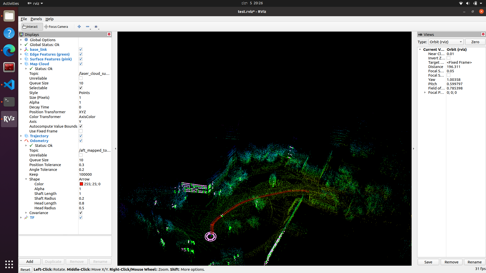
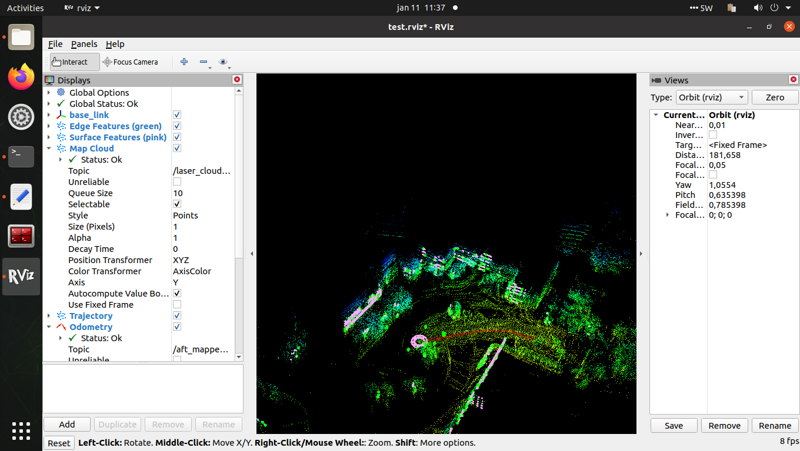
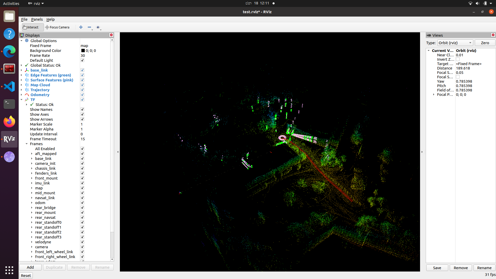
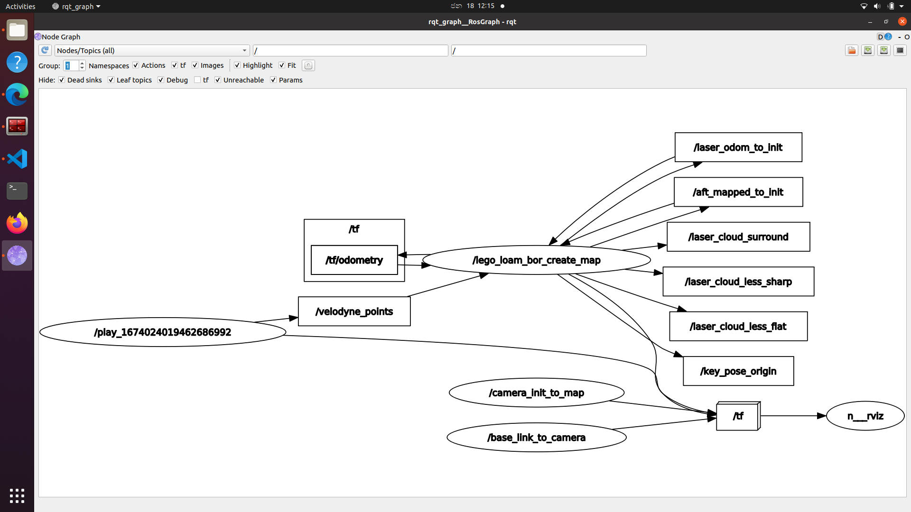

# Progress of LeGO-LOAM-BOR adoptation

## Made  compatible for ROS1 Noetic + Ubuntu 20.04 Date: 2023 Jan 5

* Execute the below commands in a terminal

```shell

# Mapping
bimalka98@LAP-BIMALKA98:~/ros/catkin_ws$ roslaunch lego_loam_bor createMap.launch rosbag:=/home/bimalka98/ros/rosbags/lego_loam/2017-06-08-15-51-45_2.bag  lidar_topic:=/velodyne_points

# Localization
bimalka98@LAP-BIMALKA98:~/ros/catkin_ws$ roslaunch lego_loam_bor localization.launch rosbag:=/home/bimalka98/ros/rosbags/lego_loam/2017-06-08-15-51-45_2.bag  lidar_topic:=/velodyne_points


```

<p align='left'>
    
</p>

# Checked on Jetson Nano

Rosbag plays with X0.8, X0.9 speeds. Reasonable.

<p align='left'>
    
</p>

----

# Integrating with the Velodyne LiDAR

## Getting an Error: `For frame [base_link]: Fixed Frame [map] does not exist`

### Checking the sol: 1
* From Velodyne tutorial [here](http://wiki.ros.org/velodyne/Tutorials/Getting%20Started%20with%20the%20Velodyne%20VLP16). If you have an error about no fixed frame, use: 
```
rosrun tf static_transform_publisher 0 0 0 0 0 0 1 map velodyne 10
```

> ChatGPT: 

This command is used to publish a static transformation from one coordinate frame to another in the Robot Operating System (ROS).

The command is calling the static_transform_publisher node from the tf package, which is a tool to publish static transforms between frames in the tf tree. The node takes the following arguments:

1. The first three arguments are the x, y, and z values of the translation of the transformation. These values represent the offset between the two frames in meters. In this case, the offset is 0 meters in all three dimensions.

2. The next three arguments are the roll, pitch, and yaw values of the rotation of the transformation. These values represent the orientation of the second frame with respect to the first frame in radians. In this case, the rotation is 0 radians in all three dimensions.

3. The next argument is the time to sleep before starting the transform. This is in seconds. In this case, the time is 1 seconds.

4. The next argument is the frame_id of the parent frame. In this case, it is 'map'.

5. The last argument is the child frame_id. In this case, it is 'velodyne'.

So this command is publishing a static transform from the 'map' frame to the 'velodyne' frame with zero translation and rotation and will sleep for 1 sec before publishing the transform. This command is useful in situations where you want to align two coordinate frames that are not directly connected in the tf tree. With this command, you can create a static transformation between two frames so that the data from one frame can be transformed into the coordinate system of the other frame.


## [Analysing the TF Tree](http://wiki.ros.org/tf/Debugging%20tools) of lego-loam-bor: [view pdf](lego-loam-bor-frames.pdf)

* TypeError: string pattern on a bytes-like object
Wanted to use https://github.com/ros/geometry/pull/193/commits/adb39545d98c8d17ecd3224a4a4ae0042614bc0b

```shell
$ rosrun tf view_frames

Listening to /tf for 5.0 seconds
Done Listening
b'dot - graphviz version 2.40.1 (20161225.0304)\n'
Traceback (most recent call last):
  File "/opt/ros/melodic/lib/tf/view_frames", line 119, in <module>
    generate(dot_graph)
  File "/opt/ros/melodic/lib/tf/view_frames", line 89, in generate # change this file using sudo gedit
    m = r.search(vstr)
TypeError: cannot use a string pattern on a bytes-like object
```

* Simply adding the .decode('utf-8') to m = r.search(vstr.decode('utf-8')) fixed it.

### RViz
<p align='left'>
    
</p>

### Rqt-Graph

<p align='left'>
    
</p>

## Git Rebase Notice

**Made the algorithms compatible with live sensor streams**

```c++
// change all occurrences
odomAftMapped.header.stamp = ros::Time().fromSec(timeLaserOdometry);

// to this ros::Time::now();
odomAftMapped.header.stamp = ros::Time::now()
```